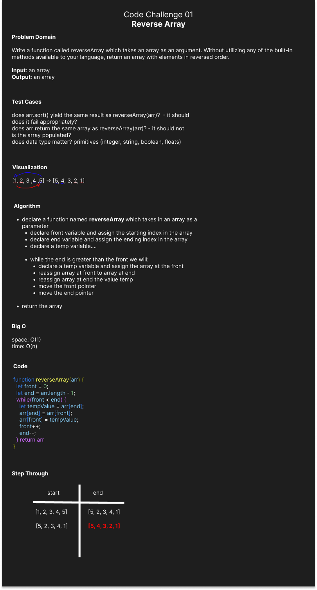

# Code Challenge 01 - Reverse Array

## Objective

Write a function called reverseArray which takes an array as an argument. Without utilizing any of the built-in methods available to your language, return an array with elements in reversed order.
___

## Whiteboard Process

___

## Approach & Efficiency

- We used inVision to write out the problem domain and visualize the problem.
- We used an algorithm to write out the process of what we wanted our code to do.

___

